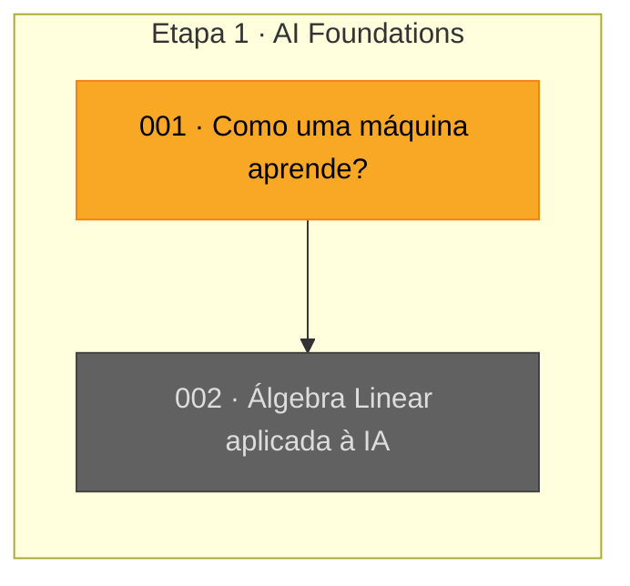

# Progresso — AI-Lab

## 🎮 Painel

<!-- progress:start -->
<!-- Bloco gerado por `uv run ai-lab progress --write`. Não edite à mão: edite progress/progress.toml. -->

```text
🧠 AI-Lab — Nível 1 · Aprendiz de Gradiente
XP  ░░░░░░░░░░░░░░░░░░░░  0 / 300  → Domador de Vetores

Etapa 1 · AI Foundations                    ░░░░░░░░░░  0/2 aulas
Etapa 2 · Machine Learning + Deep Learning  🔒
Etapa 3 · Transformers + LLMs               🔒
Etapa 4 · RAG + Agents                      🔒
Etapa 5 · MLOps + LLMOps                    🔒
Etapa 6 · AI Architecture                   🔒

🏅 Badges 0/5: ??? · ??? · ??? · ??? · ???
📅 Sessões/semana (últimas 4): 0 0 0 1  · total 1
```

### 🗺️ Skill tree

🟩 concluída · 🟨 atual · 🟦 disponível · ⬛ bloqueada



### 🎯 Missão atual

**Aula 001 — Como uma máquina aprende?** (`lessons/001-how-machines-learn.md`)

- [ ] `exercise` +10 XP — Prever o comportamento de um learning rate muito grande antes de testar
- [ ] `exercise` +10 XP — Comparar learning_rate 0.1, 0.01 e 0.001
- [ ] `exercise` +10 XP — Trocar o dataset para x = 5, y = 25
- [ ] `exercise` +10 XP — Explicar por que o learning rate é necessário
- [ ] `experiment` +20 XP — Plotar curvas de loss dos três learning rates no mesmo gráfico
- [ ] `boss` +50 XP — Explicar sem consulta: feature, target, modelo, loss, gradiente e learning rate
<!-- progress:end -->

## Como o progresso é atualizado

- Estado estruturado (atividades, XP, badges, sessões): `progress/progress.toml`.
- Regenerar o painel acima: `uv run ai-lab progress --write`.
- XP: exercício = 10 · experimento = 20 · boss fight = 50 · marco de projeto = 100.
- **Boss fight:** arguição sem consulta sobre o critério da aula. Só ela conclui a aula e desbloqueia a próxima.
- Este arquivo guarda, abaixo, o registro narrativo: conceitos, dificuldades e evolução.

## Estado atual

- Etapa: **1 — AI Foundations**
- Semana: **1**
- Aula: **001 — Como uma máquina aprende?**
- Status: **Em andamento** — teoria estudada, exercícios pendentes.

## Conceitos estudados

- [x] Feature
- [x] Target
- [x] Model
- [x] Prediction
- [x] Loss
- [x] Gradient Descent
- [ ] Learning rate — experimentar (ver Missão atual)

## Dificuldades / dúvidas

_A registrar conforme surgirem._

## Próxima atividade

Concluir os exercícios e o boss fight da **Aula 001** (checklist na Missão atual).
Só depois: **Aula 002 — Álgebra Linear aplicada à IA** (vetor, matriz, produto escalar,
multiplicação de matrizes, regressão linear com múltiplas variáveis).

## Histórico

- **2026-09-30** — Análise do estado do laboratório. Criado o sistema de progresso
  gamificado (`progress/progress.toml` + `ai-lab progress`). Checklists de exercícios
  migrados para o TOML. Item "regressão linear com múltiplas variáveis" movido para a
  Aula 002, onde se encaixa com vetores e matrizes.

## Regra de atualização

Ao concluir uma atividade importante:
1. marcar `done = true` (e badges/sessões) em `progress/progress.toml`;
2. rodar `uv run ai-lab progress --write`;
3. registrar aqui o que foi aprendido, dificuldades e o próximo passo concreto.
