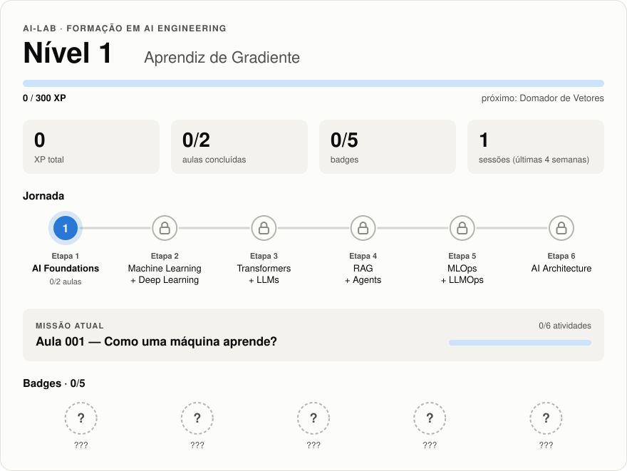
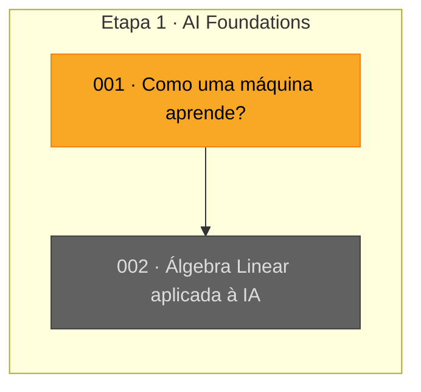

# AI-Lab

Laboratório pessoal de formação em Inteligência Artificial.

## Objetivo

Evoluir de Software Engineer para AI Engineer e posteriormente AI Architect,
com foco em fundamentos, implementação e sistemas de IA em produção.

## 🎮 Progresso

<!-- progress:start -->
<!-- Bloco gerado por `uv run ai-lab progress --write`. Não edite à mão: edite progress/progress.toml. -->

<p align="center"></p>

<details>
<summary><b>🗺️ Skill tree e missão atual</b></summary>



**Aula 001 — Como uma máquina aprende?** (`lessons/001-how-machines-learn.md`)

- [ ] `exercise` +10 XP — Prever o comportamento de um learning rate muito grande antes de testar
- [ ] `exercise` +10 XP — Comparar learning_rate 0.1, 0.01 e 0.001
- [ ] `exercise` +10 XP — Trocar o dataset para x = 5, y = 25
- [ ] `exercise` +10 XP — Explicar por que o learning rate é necessário
- [ ] `experiment` +20 XP — Plotar curvas de loss dos três learning rates no mesmo gráfico
- [ ] `boss` +50 XP — Explicar sem consulta: feature, target, modelo, loss, gradiente e learning rate

</details>
<!-- progress:end -->

Detalhes e histórico em [PROGRESS.md](PROGRESS.md).

## Como usar com Claude Code

Na raiz do projeto:

```bash
cd ~/AI-Lab
claude
```

Depois:

```text
Leia CLAUDE.md, ROADMAP-IA.md e PROGRESS.md.
Quero continuar minha formação em IA exatamente de onde parei.
Verifique meu progresso e me conduza pela próxima atividade.
Não avance automaticamente se houver exercícios pendentes.
```

## Estrutura

```text
AI-Lab/
├── CLAUDE.md
├── ROADMAP-IA.md
├── PROGRESS.md
├── README.md
├── pyproject.toml
├── lessons/
│   └── 001-how-machines-learn.md
├── progress/
│   ├── progress.toml        # fonte da verdade do progresso gamificado
│   └── dashboard.svg        # card gerado exibido acima
├── src/ai_lab/
│   ├── progress.py          # XP, níveis, desbloqueios e painel Markdown
│   └── card.py              # card SVG do README
└── tests/
```

## Progresso gamificado

```bash
uv run ai-lab progress          # painel no terminal
uv run ai-lab progress --write  # regenera PROGRESS.md, README.md e o card SVG
uv run pytest                   # valida dados e regras
```

## GitHub público

Este conteúdo foi pensado para poder ser público.
Antes de publicar, confira se o repositório não contém:

- API keys;
- tokens;
- credenciais;
- arquivos `.env`;
- dados privados;
- documentos de trabalho confidenciais.
